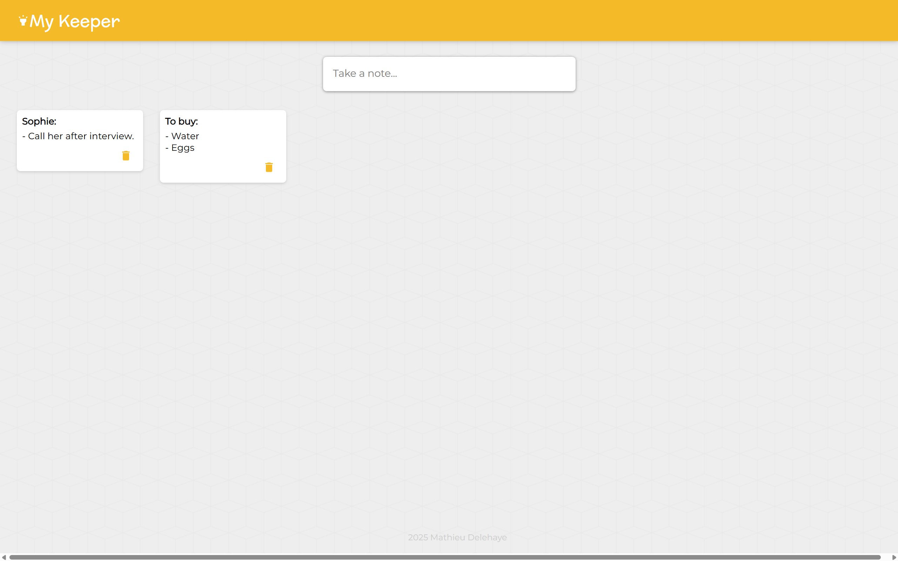
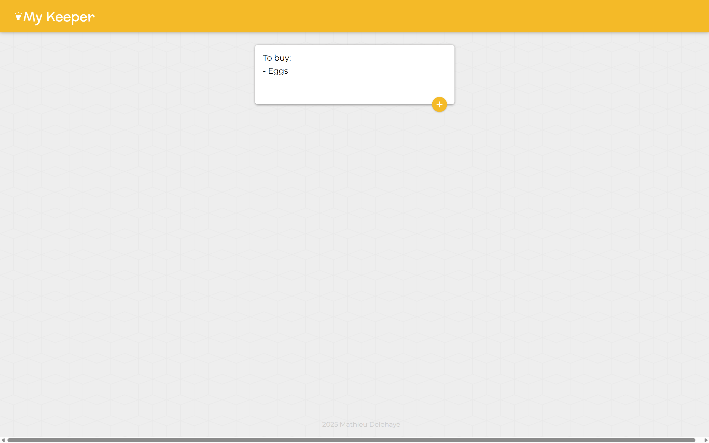
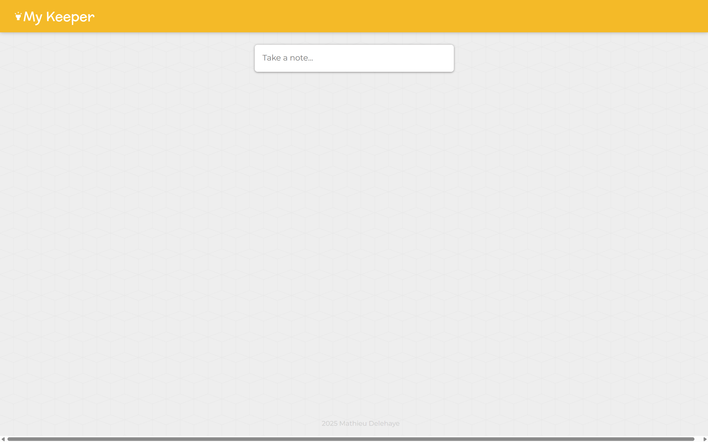

# web3-react-keeper

A decentralized Google Keep clone built with React.js and Web3 backend

## Live Demo

🌐 **Frontend (Live on Web3 blockchain (Internet Computer)):** https://az3lm-tqaaa-aaaaj-qntaq-cai.icp0.io/

🔗 **Backend API (Web3 blockchain (Internet Computer)):** https://a4gq6-oaaaa-aaaab-qaa4q-cai.raw.icp0.io/?id=a62ny-6iaaa-aaaaj-qntaa-cai

## Screenshots





## Features

- **Decentralized Storage**: Notes are stored on the Web3 blockchain (Internet Computer)
- **React.js Frontend**: Modern, responsive user interface
- **Web3 Backend**: Powered by Web3 blockchain (Internet Computer) canisters
- **Material Design**: Clean and intuitive Google Keep-inspired interface
- **Real-time Updates**: Seamless note creation, editing, and deletion
- **Persistent Storage**: Your notes are permanently stored on the blockchain

## Technology Stack

- **Frontend**: React.js, Material-UI
- **Backend**: Motoko (Web3 blockchain (Internet Computer))
- **Blockchain**: Web3 blockchain (Internet Computer) Protocol (ICP)
- **Build Tool**: DFX (DFINITY SDK)

## Local Development

### Prerequisites

- [DFX](https://internetcomputer.org/docs/current/developer-docs/setup/install/) (DFINITY SDK)
- [Node.js](https://nodejs.org/) (v16 or higher)
- [npm](https://www.npmjs.com/) or [yarn](https://yarnpkg.com/)

### Setup Instructions

1. **Clone the repository**
   ```bash
   git clone https://github.com/your-username/web3-react-keeper.git
   cd web3-react-keeper
   ```

2. **Start the local Web3 blockchain (Internet Computer) replica**
   ```bash
   dfx start --background
   ```

3. **Deploy the canisters locally**
   ```bash
   dfx deploy
   ```

4. **Install frontend dependencies**
   ```bash
   cd src/dkeeper_frontend
   npm install
   ```

5. **Start the development server**
   ```bash
   npm start
   ```

6. **Open your browser**
   Navigate to `http://localhost:3000` to see the application running locally.

### Building for Production

1. **Build the frontend**
   ```bash
   cd src/dkeeper_frontend
   npm run build
   ```

## Project Structure

```
web3-react-keeper/
├── src/
│   ├── dkeeper_backend/
│   │   └── main.mo          # Motoko backend logic
│   └── dkeeper_frontend/
│       ├── src/             # React.js frontend source
│       ├── public/          # Static assets
│       └── package.json     # Frontend dependencies
├── dfx.json                 # DFX configuration
└── README.md
```

## Contributing

1. Fork the repository
2. Create your feature branch (`git checkout -b feature/AmazingFeature`)
3. Commit your changes (`git commit -m 'Add some AmazingFeature'`)
4. Push to the branch (`git push origin feature/AmazingFeature`)
5. Open a Pull Request

## License

This project is licensed under the MIT License - see the [LICENSE](LICENSE) file for details.

## Acknowledgments

- Inspired by Google Keep
- Built with Web3 blockchain (Internet Computer) technology
- Material-UI for the component library
